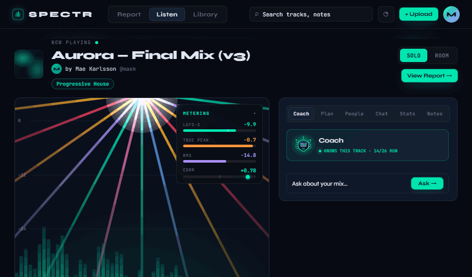
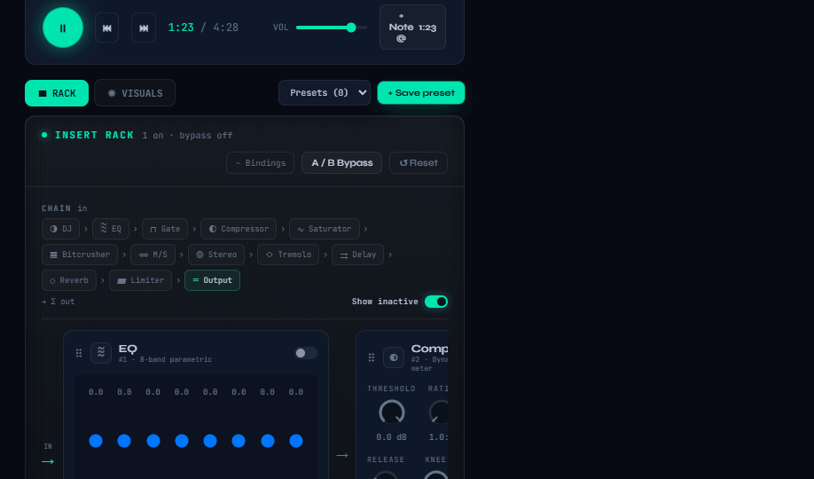
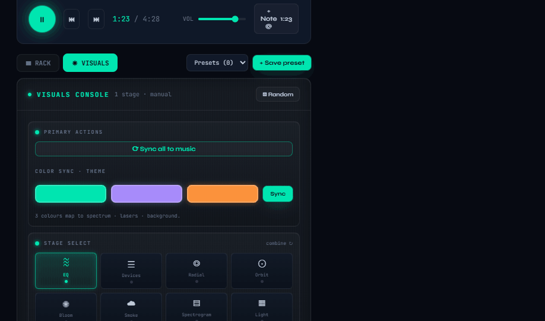
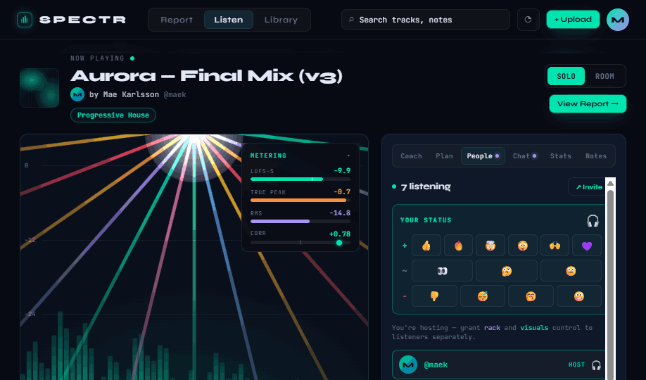

# Handoff: SPECTR · Listen — Rack & Visuals Redesign

## Overview
This is the redesigned **Listen** page for SPECTR — the screen where a finished track plays back through a live, reorderable effects rack while a host-driven visualizer runs above it, with an AI coach, presets, and (in Room mode) live presence/chat. It is built directly on top of your real control surface: the rack renders from a verbatim port of `features/listen/rackManifest.ts` + `audio/state.ts`, so every knob, range, default, and binding string matches the engine the implementer will wire to.

The goal of this handoff is **not** to ship these files. It is to **recreate this design inside the SPECTR codebase** using its real React environment, its audio graph, and its real-time/persistence layers. The HTML/JSX here is a faithful, interactive **design reference** — pixel-accurate look and fully specified behavior — that happens to already be structured as React components so the port is mostly mechanical.

> **Read this first, then `PORTING_GUIDE.md`.** This README is the *what* (architecture, state, screens, tokens). The porting guide is the *how* (module conversion, the mock→engine swap boundary, and the exact state→audio-graph binding map).

---

## About the design files
- The files in `src/` are **real React components**, currently loaded by a prototype host (`preview/Listen Rack Redesign.html`) that compiles JSX in-browser via Babel. That host is a viewing convenience **only** — do not ship it, and do not "convert the rendered HTML." Port the `src/*.jsx` modules.
- Components are shared across files through a `window`-global pattern (each file ends with `Object.assign(window, { … })`) purely because the prototype loads them as separate `<script>` tags with no bundler. In production these become normal ES `import`/`export`. The guide covers the exact transform.
- `src/data.jsx` is deliberately split into **engine truth** (ported from your repo — keep) and **mock data** (track/room/coach fixtures — replace). That split is the single most important thing to understand; see "Data layer" below.

## Fidelity
**High-fidelity.** Final colors, typography, spacing, motion, and interaction behavior. Recreate the UI pixel-for-pixel using the codebase's existing primitives where they exist (buttons, cards, avatars, brand mark). All design tokens are listed at the bottom of this file and defined in `src/styles.css :root`.

---

## Screenshots
Reference captures of the built design (in `screenshots/`). These are the look-and-behavior target to recreate in-codebase.

**1 — Solo / default.** Hero + host-driven visualizer (laser fan over spectrum), live metering overlay, and the Coach rail.

**2 — Rack (bottom module).** The insert chain — drag-reorderable device chips, A/B bypass, Reset, "Show inactive", and inline rich controls (EQ band editor, Compressor knobs). Renders from the verbatim manifest port.

**3 — Visuals console (bottom module).** "☀ VISUALS" view: Primary actions (Sync all to music), 3-colour theme sync, and the multi-select Stage grid (EQ / Devices / Radial / Orbit / Bloom / Smoke / Spectrogram / Light) that composites layers.

**4 — Room / People rail.** Presence ("7 listening"), your-status reaction picker (positive / neutral / negative), and host **control granting** — rack and visuals delegated separately.

---

## Architecture & module graph

Load order (top defines globals the next consumes). Each module's role and its production fate:

| # | File | Role | Production fate |
|---|------|------|-----------------|
| 1 | `components.jsx` | Borrowed primitives from the **existing** mockup set. Redesign only uses **`BrandMark`** and **`CoverArt`**. | **Map to your real components.** Don't port these copies. |
| 2 | `data.jsx` | Manifest + defaults (engine truth) **and** track/room/coach fixtures (mock). | Split: keep manifest, replace mock — see Data layer. |
| 3 | `ui.jsx` | Control primitives: `Knob`, `Fader`, `Switch`, `Segmented`, `SelectChip`, `HSlider`, `GRMeter`, `ModuleIcon`, `BindTag`, `WorkletPill`, `ParamControl`, `SegBar`, `Avatar`, `BotFace`, `CoachBot`, `HueSlider`, plus `useDragValue`, `cssVar`, `hslToHex`. | Port. These are the reusable design system for the page. |
| 4 | `viz.jsx` | The visualizer stage: `VizStage`, `StageCanvas`, `LaserFan`, `Fireworks`, `EqCurveOverlay`, `freqToX`, `LASER_COLORS`. | Port — but **swap synthetic audio data for a real `AnalyserNode`** (see guide). |
| 5 | `transport.jsx` | `Transport` (scrubber + section ribbon + note markers + reaction ticker), `SECTION_COLORS`, `fmtTime`. | Port; bind to real playback clock. |
| 6 | `rack-core.jsx` | **The rack's brain.** `useRackState` (live module state), `useFakeGR`, `useChainReorder`, and shared renderers `RackChrome`/`CompactControls`/`ExpandedPanel`/`EqBandEditor`/`CoachStrip`/`RichControls`, `MiniEqCurve`, `KEY_PARAMS`. | Port renderers; **replace `useRackState` internals with your audio-graph store**, replace `useFakeGR` with `readEffectMeter`. |
| 7 | `rack-layouts.jsx` | Three IA directions: `InlineRack` (chosen default), `ConsoleRack`, `StudioRack`; plus `RichModulePanel`, `ChainCap`, internal `PresetMenu`. | Port **`InlineRack` only** unless you want the layout toggle. |
| 8 | `rail.jsx` | Right-rail tabs: `RightRail`, `VisualMeters`, `VisualsPanel`, `CoachPanel`, `PeoplePanel`, `ChatPanel`, `StatsPanel`, `NotesPanel`. | Port; bind People/Chat to real-time, Coach to real analysis. |
| 9 | `tweaks-panel.jsx` | Prototype-only Tweaks UI (`useTweaks`, `TweaksPanel`, `Tweak*`). | **Drop entirely.** It exists to demo design variants. |
| 10 | `app.jsx` | `App` root — owns all top-level state and orchestration. | Port as the page container; see State model. |

### Cross-module dependencies
The dependency vocabulary is exactly each file's export list (the `Object.assign(window, …)` footer). A file depends on another iff it references one of its exported names. Practically:
- `ui.jsx` is the leaf everything draws from (controls/avatars). It depends only on `data.jsx` (`fmtVal`, `cssVar` reads tokens) + React.
- `rack-core.jsx` depends on `data.jsx` (manifest) + `ui.jsx` (controls) + `viz.jsx` (`freqToX` for `MiniEqCurve`).
- `rack-layouts.jsx` depends on `rack-core.jsx` + `ui.jsx` + `data.jsx`.
- `rail.jsx` depends on `ui.jsx` + `data.jsx` + `viz.jsx` (meters) + `rack-core.jsx` (coach).
- `app.jsx` depends on everything.
- `viz.jsx`/`transport.jsx` depend on `ui.jsx` + `data.jsx`.

---

## State model (owned by `App` in `app.jsx`)

One component holds the page's orchestration state. The shape, grouped by concern:

**Playback**
- `playing: boolean`, `position: number` (seconds) — driven by a `requestAnimationFrame` clock. **Replace with the real player's transport** (`position` should read the audio element/engine, `playing` toggles it).

**Mode**
- `mode: 'solo' | 'room'` — the header SegBar. Solo = private mastering session; Room = social listen-together.
  - ⚠️ The **Three-Modes spec** (`docs/Listen Modes Spec.html`) proposes evolving this into **Work / View / Room**. The current code ships Solo/Room. Reconcile before building — the spec is the newer intent; treat `mode` as the seam where that lands.

**Rack** — `rs = useRackState()`
- The live effects state: `rs.mod` (per-module params), `rs.order` (chain order), `rs.masterBypass`, `rs.selected`, `rs.presets`, plus mutators `setParam/setEnabled/setEqBands/setOrder/reset/applyCoach/savePreset/recallPreset`. **This is the primary engine binding point** — see the binding map in the guide.

**Visuals**
- `viz: {…}` — a flat bag of every visual parameter: `barColor`, `laserOn/laserEffect/laserPattern/laserIntensity/laserColor/laserBeams/laserSpeed/laserMove/laserFlash/laserMono/laserSync`, `bg/bgAuto/bgFlash/bgFlashHz/bgFlashColor/bgSync`, `autoColor`, `autoReact/autoReactSens`, `energy`, `specHue/bgHue/laserHue`, `theme[]`.
- `stages: string[]` — active visualizer layers (multi-select composite; e.g. `['eq','radial']`). Registry in `data.jsx → STAGES`.
- `director: string` — auto-director id (`data.jsx → DIRECTORS`). Selecting a non-manual director pushes its `apply` block into `viz`.
- `vizPresets: []` + `saveVizPreset/recallVizPreset` — local visual presets (separate store from rack presets).

**Collaboration (mock real-time — replace wholesale)**
- `pops` (presence bursts on the stage), `feed` (reaction ticker), `myStatus` (your active emoji), `rackController`/`visualController` (who currently holds control), `announcement` (coach toast). All currently driven by `setInterval` + random fixtures.

**Layout**
- `ia: 'inline'|'console'|'studio'` — rack layout variant (a prototype Tweak; **pick `inline`**).
- `bottomView: 'rack'|'lights'` — swaps the bottom module between the rack and the Visuals console.
- `metersOpen`, `studioOpen` — local UI toggles.

---

## Data layer — the swap boundary (`src/data.jsx`)

**Keep (engine truth, already ported from your repo — verify against current source):**
- `MODULE_DEFAULTS` — per-module neutral defaults (from `audio/state.ts`).
- `DEFAULT_ORDER` — the insert chain at rest (from `audio/state.ts`; pitch is intentionally **not** in it).
- `RACK_MANIFEST` + `PITCH_MODULE` — every module's params/ranges/units/defaults and its `bind` string (from `rackManifest.ts`). `MANIFEST_BY_ID`, `MASTERING_IDS`, `CREATIVE_IDS`, `EQ_BANDS_DEFAULT` derive from it.
- `fmtVal(unit, v)` — value formatting conventions (dB, Hz, %, ratio, etc.).

**Replace (mock fixtures → real data/state):**
- `TRACK` — the playing track + its analysis (loudness/stereo/sections/notes). Wire to your real track + analysis selectors.
- `COACH_SUGGESTIONS` — AI coach output; each carries an `apply` patch onto the rack. Wire to real coach results.
- `ROOM_LISTENERS`, `ROOM_REACTIONS`, `REACTION_EMOJI`, `REACTION_GROUPS` — presence + reactions; wire to your real-time layer.
- `PLAN_ITEMS` — analysis-derived fix list (Plan tab); each has an `apply` patch.

**Config (keep as config, tune freely):**
- `STAGES`, `DIRECTORS` (+ their `apply` blocks = the auto-director design intent), `DIRECTOR_SETTINGS`, `LASER_EFFECTS`, `LASER_PATTERNS`, `BG_COLORS`.

---

## Screens / views

It is a **single screen** with a mode switch, a swappable bottom module, and a tabbed right rail.

**Page frame** (`app.jsx → App`)
- **TopNav** — brand mark + nav tabs (Report / **Listen** / Library) + search + Upload + avatar. Fixed-height bar.
- **Container** — `max-width: 1640px; margin: 0 auto; padding: 20px 28px 64px`.
- **TrackHeader** — `CoverArt` (md) + title (23px/800) + author row (`Avatar` + "by … @handle") + genre pill; right side: **Solo/Room SegBar** + "View Report →". 16px bottom margin.
- **Main grid** — `grid-template-columns: minmax(0,1fr) 348px; gap: 18px; align-items: start`.

**Left column**
1. **Stage card** (`position: relative; overflow: hidden`) containing, stacked:
   - `PresencePops` (absolute overlay, z 8) — avatar bursts on reactions (Room).
   - `VisualMeters` (collapsible overlay) — loudness/stereo readouts over the stage.
   - `VizStage` (`height: 440`) — the host-driven visualizer; multi-stage composite, lasers, fireworks on drops, EQ-curve overlay, auto-director.
   - `CoachToast` — typed "Applied …" announcement + background flash.
   - `Transport` (separated by `border-top`) — scrubber, section ribbon, note markers, reaction ticker.
2. **Bottom module**
   - Toggle row: **▦ RACK** / **☀ VISUALS** + a context-aware **Presets** select + **+ Save preset** + a "controlled by @handle" chip when control is delegated.
   - Body: `InlineRack` (default) — the full effects chain with inline rich controls and drag-reorder — **or** `VisualsPanel` (the lighting console).

**Right rail (348px)** — `RightRail` renders a tab set whose contents depend on `mode`:
- `VisualMeters`/`StatsPanel` (analysis readouts), `CoachPanel` (Solo), `PeoplePanel` + `ChatPanel` (Room presence/chat + control granting), `NotesPanel` (timestamped track notes), `VisualsPanel` controls.

Full per-feature breakdown (every control, state hint, and the Work/View/Room mode tags) lives in **`docs/Listen Feature Reference.html`** — 19 sections. The three-mode model is in **`docs/Listen Modes Spec.html`**.

---

## Interactions & behavior (highlights)
- **Transport clock** — rAF advances `position`; at `durationSec` it resets and pauses. Seeking sets `position`; clicking a note seeks to its `t`.
- **Rack** — every control writes through `rs.setParam/setEnabled/setEqBands`; chain is pointer-drag reorderable (`useChainReorder`); A/B master bypass; Reset to defaults; "⌁ Bindings" reveals each module's `bind` string (a dev aid — hide in prod).
- **EQ** — 8-band editor; dragging a band redraws the curve on the stage (`EqCurveOverlay`).
- **Coach** — suggestions render with an **Apply** button that batches `rs.applyCoach(apply)` across modules and fires the `CoachToast`.
- **Visualizer** — `stages` is multi-select (layers composite); `director` non-manual selection pushes an `apply` block into `viz` and auto-cycles stages on a cadence; lasers/fireworks/background flash all read `viz`.
- **Room** — interval spawns presence pops + reaction-ticker entries; drops trigger a wave of 🔥 pops; control can be granted per-scope (rack vs visuals) to a listener, shown by the controller chip.
- **Motion** — `pulseGlow`, `presencePop`, `ringPulse`, coach flash/stream; defined in `styles.css`.

## Assets
- No raster assets. `BrandMark`/`CoverArt` are SVG/CSS primitives from the existing mockup set — **use your real brand components**. `Avatar`/`CoachBot`/`BotFace` are drawn in `ui.jsx` (the coach mascot matches the provided reference). Fonts are Google Fonts **Syne** (display/UI) + **JetBrains Mono** (labels/numerics).

---

## Design tokens (`src/styles.css :root`)

**Surfaces** `--bg #070a12` · `--bg-2 #0a0f1c` · `--surface #0d1525` · `--card #0f1828` · `--card-2 #11192a` · `--card-hover #141f34`
**Borders** `--border rgba(255,255,255,.07)` · `--border-2 rgba(255,255,255,.12)`
**Accents** `--cyan #00e5b0` (primary) · `--violet #a78bfa` · `--orange #fb923c` · `--red #f43f5e` · `--green #34d399` · `--yellow #fbbf24` · `--blue #60a5fa` (each with a `-dim`/`-glow` companion where used)
**Text** `--text #e2e8f4` · `--text-2 #c0cad8` · `--muted #64748b` · `--dim #1e293b`
**Radii** `--radius 12px` · `--radius-sm 8px` · `--radius-lg 16px`
**Type** Syne 400–800 (UI/display); JetBrains Mono 400–700 (`.mono`, `tnum`). Module accent colors come from each manifest entry's `accent` token.

## Files
- `src/*.jsx` — the design, as React components (see the module table).
- `src/styles.css` — all tokens, layout, and component CSS.
- `src/components.jsx` — borrowed `BrandMark`/`CoverArt` (reference only — map to real).
- `preview/Listen Rack Redesign.html` — prototype host (view-only; not for production).
- `docs/Listen Feature Reference.html` — exhaustive per-feature reference (controls, state hints, mode tags; §6 = presets/versions data model).
- `docs/Listen Modes Spec.html` — the Work / View / Room model.
- `PORTING_GUIDE.md` — module conversion, mock→engine swap, and the state→audio-graph binding map. **Read it next.**
