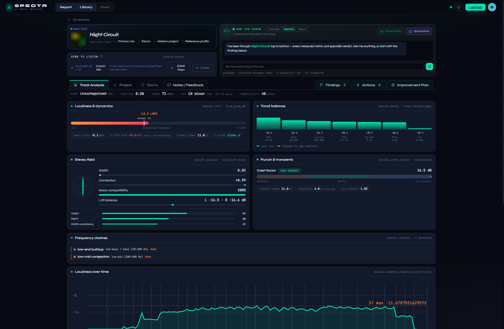
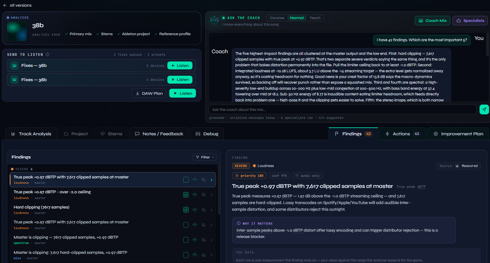
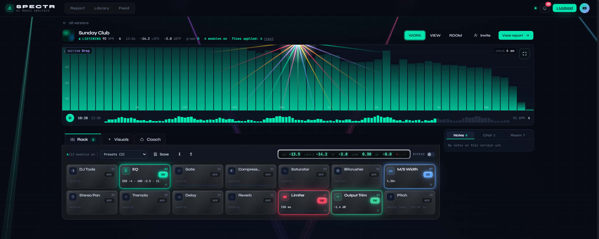
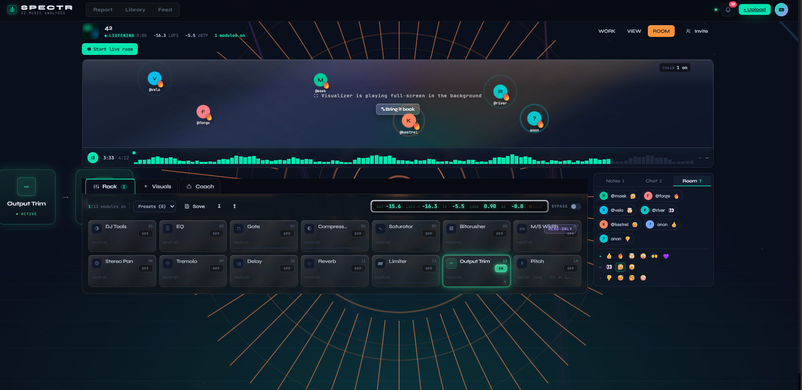
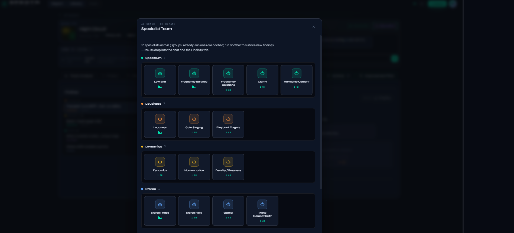
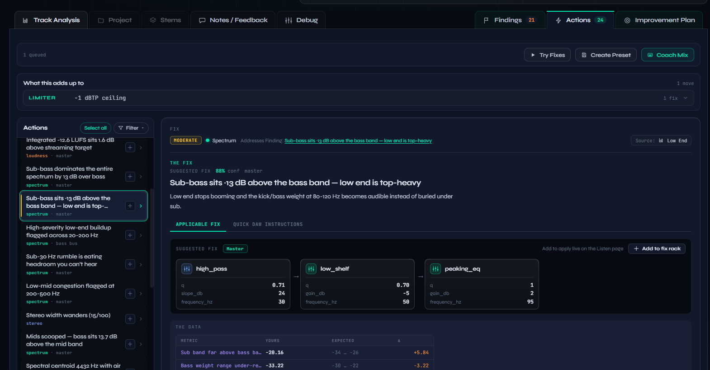
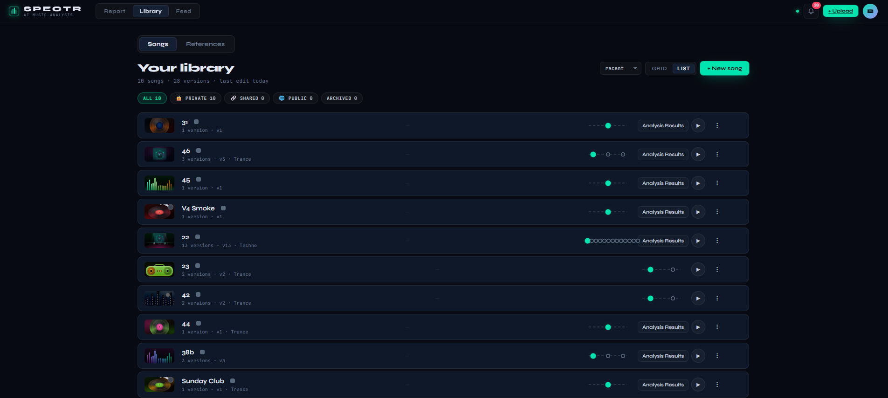
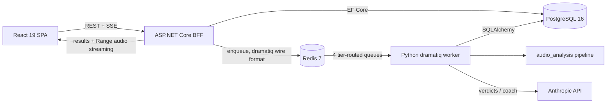

# SPECTR

SPECTR is a web app for music producers: upload a mix and an AI coach walks you through what's wrong with it and how to fix it — grounded in a multi-phase signal-analysis report and deterministic, genre-aware problem detection, backed by on-demand specialist verdicts, with a real-time in-browser DSP rack for hearing each fix against the original before committing to it.









Demo video: _coming soon_.

## What it does

- **Multi-phase analysis pipeline** (7 phases; 8 with an Ableton project file). Phase 1 measures integrated LUFS (pyloudnorm), true peak (4× oversampled dBTP), clipping, 7-band frequency balance, stereo width and mono compatibility, key, BPM, and song structure (allin1 model, run in Docker). Later phases add genre auto-detection, genre-specific scoring, stem-level frequency clash detection, reference-track deltas, percentile ranking against a curated reference library, and arrangement analysis (section lengths, energy contrast).
- **Ableton `.als` project analysis.** Uploading the project file unlocks an eighth phase that parses the device chains — executed in an isolated subprocess with a timeout and memory cap, so a malformed project degrades one phase instead of killing the job.
- **AI mix coach.** A per-track chat grounded in the report's measured values — the model answers from the data it was handed, not from guesswork — with three reply modes (Concise / Normal / Teach), a per-finding "ask the coach about this" entry point, and replies streamed token-by-token to the UI. Message caps are enforced server-side per tier.
- **Coach Mix → Fix Rack → your ears.** Findings and coach suggestions queue into a Fix Rack; the Coach Mix arbiter compiles the queued fixes into one DSP chain applied to the Listen rack, so every suggestion is heard A/B against the dry mix before it's committed — or exported as a step-by-step DAW plan.
- **Deterministic problem engine.** A rule engine turns measured values into typed Problem records using genre-relative thresholds (the same measurement can be fine in techno and a defect in trance). Rules are tiered — single-metric rules plus corroborated multi-metric composites that absorb their children — and never grade data that wasn't provided.
- **On-demand AI specialists.** A triage pass builds a routing plan over 27 prompt-versioned specialists (loudness, low end, stereo field, gain staging, frequency collisions, stem balance, arrangement, and more). Verdict JSON is schema-validated, and priority scores are recomputed by a deterministic formula — LLM-supplied scores and severities are never trusted as-is.
- **Bulk stem upload with audio-content classification.** Up to 100 stems per version; roles (drums, bass, vocals, …) are detected from audio content, not filenames, then confirmed by the user. Grouped bus analysis by default, per-stem mode opt-in.
- **Listen rack.** A Web Audio DSP chain wrapped around the original upload: 8-band EQ, compressor with makeup gain, parallel saturation, M/S width matrix, and pitch — with live FFT spectrum and L/R metering. Fixes carried over from the report can be toggled and A/B'd against the dry signal without leaving the browser.
- **Listening rooms and audio-reactive visuals.** A version can be shared into a live room — listener roster, chat, reactions, synced transport — and the player carries a music-reactive visual stage (spectrum, laser rig, strobe patterns, an auto-program that reacts to song intensity).
- **Anonymous instant analysis.** A visitor can analyze one track without an account; registering claims the device's history server-side.
- **Accounts and operations.** JWT auth with httpOnly refresh cookies, Stripe subscriptions and credit packs behind live feature flags, per-tier LLM budgets, retention sweeps, transactional email, and a worker-health dashboard.

## Architecture

The browser talks only to an ASP.NET Core BFF, which owns auth, uploads, entitlements, and audio streaming. Analysis work is enqueued to Redis and consumed by a Python worker that runs the audio pipeline and LLM calls, writing results to PostgreSQL where the BFF reads them back. There is no HTTP hop between the .NET and Python sides — the BFF writes dramatiq's Redis wire format directly.



## Stack

| Component | Purpose | Tech |
|---|---|---|
| `components/bff/` | Auth, songs/versions, uploads, audio streaming, job dispatch, verdicts, billing | ASP.NET Core (.NET 10), EF Core 10, Npgsql, StackExchange.Redis |
| `components/frontend-spectr-v2/` | SPA — library, results, coach, Listen rack | React 19, Vite 6, TypeScript strict, TanStack Router/Query, CSS Modules, Radix UI, WaveSurfer, Recharts |
| `components/worker/` | Job consumer — analysis pipeline, rule engine, LLM gateway | Python 3.11, dramatiq, SQLAlchemy 2 (sync), Pydantic v2 |
| `components/analysis/` | Installable audio-analysis package (the pipeline itself) | librosa, pyloudnorm, Demucs, torchopenl3 |
| `components/shared/` | SQLAlchemy models mirroring the EF Core schema for the worker | Python, SQLAlchemy 2 |
| `components/workerdash/` | Local ops dashboard — queue contents, worker health, run history | Python, localhost-only |
| `components/api/` | Frozen v1 (FastAPI) — superseded by the BFF + worker; excluded from CI and deploys, kept until fully harvested | FastAPI, Celery |

PostgreSQL 16 and Redis 7 run in Docker for local dev; `infra/` holds the production compose stack, deploy script with health-checked rollback, and Prometheus/Grafana config.

## Engineering notes

- **The language split is the architecture.** Everything user-facing and transactional (auth, entitlements, uploads, streaming, billing) lives in one .NET service; everything compute-heavy (DSP, ML models, LLM calls) lives in the Python worker. The seam is a job queue, not HTTP: the BFF writes dramatiq's exact Redis wire format (message HASH + id LIST, kept in lockstep inside a MULTI/EXEC transaction), so the worker consumes .NET-enqueued jobs natively.
- **One schema, two ORMs, drift guarded.** EF Core owns the canonical schema and migrations; a shared SQLAlchemy package mirrors those entities for the worker. Schema-contract tests and golden-snapshot fixtures on the pipeline output catch divergence between the two sides.
- **Long-running jobs never hold a transaction.** Analysis runs in a three-phase pattern: claim the job and commit, compute with no DB session open (phases can take minutes), then write results in a fresh session. Each phase is individually fault-isolated, so a partial failure produces a degraded report plus a free retry instead of nothing.
- **Queue topology is a fairness guarantee.** Four named queues (no `default`), tier-routed at dispatch; free-tier jobs can't starve paid ones because production runs separate worker pools per lane — process separation rather than trusting intra-worker priorities. An enforcement test fails the build if any actor or enqueue site targets a nonexistent queue.
- **LLM output is untrusted input, and LLM input is measured data.** Coach and specialist prompts are grounded in the report's measured values rather than asking the model to imagine the audio; verdicts coming back are Pydantic-validated, re-scored by a deterministic Python formula, and severity-capped. Spend is governed twice, independently — the BFF caps message counts per tier while the worker's gateway enforces dollar budgets from live feature flags.
- **CI verifies from a clean checkout.** Integration tests run against real Postgres and Redis services with a fail-loud tripwire (an unreachable DB is a failure, never a silent skip), gitleaks scans the full git history on every push, and container images are Trivy-scanned before they are pushed; the deploy script rolls back on a failed health check.

## Quickstart

Local development targets Windows (PowerShell) with Docker Desktop, the .NET 10 SDK, Node 22, and Python 3.11:

```powershell
./scripts/start-spectr.ps1     # stops anything running, starts Postgres+Redis,
                               # applies migrations, launches BFF + worker + frontend
```

Frontend: http://localhost:5174 · BFF OpenAPI: http://localhost:5000/openapi/v1.json

[docs/STARTUP.md](docs/STARTUP.md) is the canonical startup guide: manual per-component boot, fresh-machine setup, verification steps, and a catalog of known failure modes with fixes. Production deployment is documented in [docs/runbook.md](docs/runbook.md).

## Validation and testing

Every component has its own gate, and all of them run in CI on every push — the frontend alone has four lint gates that fail on a single warning:

```bash
cd components/bff && dotnet build && dotnet test        # integration tests hit real Postgres/Redis

cd components/frontend-spectr-v2
npx vite build && npx tsc -b                            # build generates route types, then strict type-check
npm run lint && npm run lint:css && npm run lint:prices && npm run lint:focus
npx vitest run                                          # includes axe-core accessibility smoke tests

pytest -q components/worker/tests/                      # golden fixtures + queue/boundary enforcement tests
pytest -q components/analysis/tests/                    # heavy models mocked
pytest -q components/shared/tests/
ruff check components/worker/ components/shared/ components/analysis/src/
```

## Project structure

```
├── components/          # bff, frontend-spectr-v2, worker, analysis, shared, workerdash, api (frozen v1)
├── docs/                # STARTUP.md, runbook.md, architecture docs, doc index
├── infra/               # production compose, deploy/backup scripts, monitoring config
├── docker/              # local dev compose (Postgres, Redis, allin1)
├── scripts/             # dev orchestration (stack launcher, job recovery)
├── schemas/             # analysis output data contract + samples
├── data/                # runtime data (gitignored except reference-library config)
└── PRPs/                # written implementation plans — see Development workflow
```

## Development workflow

The project is built AI-assisted with a plan-first process: every feature starts as a written implementation plan (a "PRP") with explicit context, steps, and validation gates that must pass before the work is considered done. Active plans live in `PRPs/`, executed ones are archived with dates in `PRPs/archive/` — the archive doubles as a build history. `CLAUDE.md` carries the standing project rules and per-component gotchas that keep sessions consistent.

## Status and limitations

- **v2 (BFF + worker + React SPA) is the product.** The v1 FastAPI stack in `components/api/` is frozen, excluded from CI and deploys, and boundary-enforced by a worker test; it remains only until the last pieces are harvested.
- **Pre-launch.** The MVP is code-complete and the deploy pipeline exists (images, Trivy scans, SSH deploy with rollback), but the app is not publicly hosted yet. Billing and the credit system are complete but disabled by a live feature flag.
- **Local dev tooling is Windows-first.** The stack launcher and troubleshooting docs assume PowerShell + Docker Desktop; the production stack itself is Linux compose.
- **Demucs stem separation is off by default** — the fast spectral-analysis path (seconds) is used instead of the full ML split (10–20 minutes CPU per track); the Demucs path exists behind a flag.
- **The pitch tool couples pitch and tempo** (Web Audio `detune` scales playback rate). Tempo-independent shifting needs an AudioWorklet phase vocoder and is not built.
- **Audio streaming auth uses a short-lived JWT query parameter** (HTMLMediaElement cannot send headers). Documented tradeoff; the plan pre-launch is signed, expiring audio URLs.
