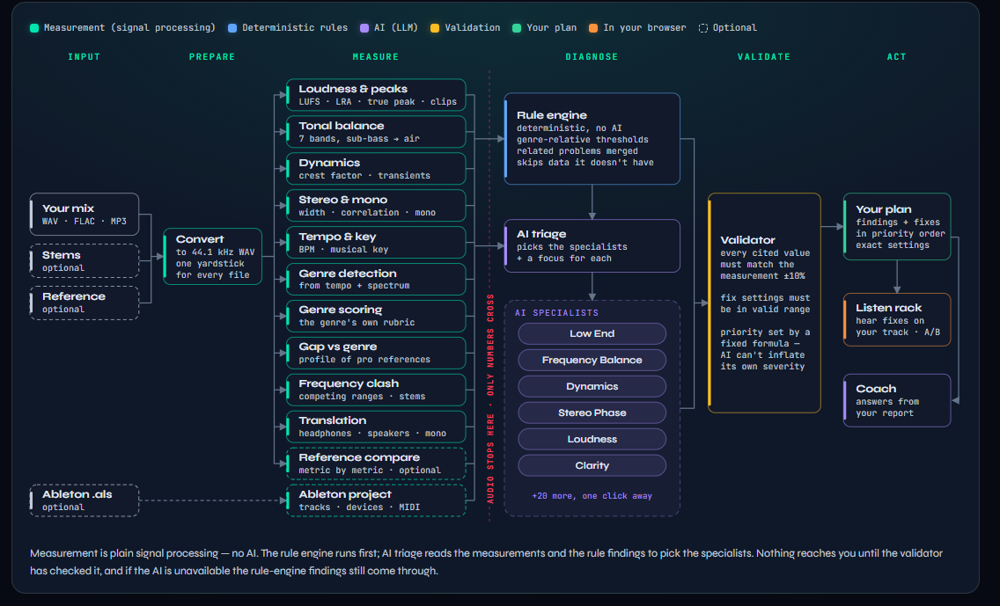
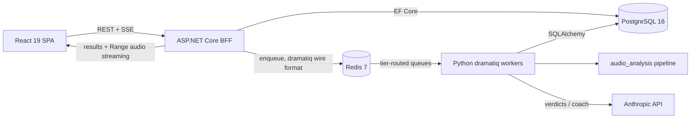

<div align="center">

# SPECTR

**Mix analysis you can work with: measured findings, exact fixes, and a way to hear each fix on your own track before you touch your DAW.**

### Live at [spectrmix.com](https://spectrmix.com)

[Open the demo](https://spectrmix.com/demo) · [Analyze a track](https://spectrmix.com/analyze) · [Features](https://spectrmix.com/features) · [How it works](https://spectrmix.com/trust/how-its-built)

No account is needed for the demo or for your first analysis.

</div>

---

SPECTR is a web app for music producers. Upload a bounce of your mix and it measures the audio, finds the problems, and gives you a specific fix for each one: which processor, which frequency, how much. You can switch every fix on in the browser and hear it on your own track, ask an AI coach about anything in the report, and leave with a plan to follow in your DAW.

## Contents

- [Features](#features)
- [How it works](#how-it-works)
- [Architecture](#architecture)
- [Stack](#stack)
- [Engineering notes](#engineering-notes)
- [Quickstart](#quickstart)
- [Validation and testing](#validation-and-testing)
- [Project structure](#project-structure)
- [Development workflow](#development-workflow)
- [Status and limitations](#status-and-limitations)

## Features

| | |
|---|---|
| **Hear every fix on your own track** | Each suggested fix can be switched on live in the browser, one at a time or stacked. Flip Bypass to compare with the original and adjust any setting. No export, no plugin. |
| **An exact fix for every problem** | Not "tame the low end" but a specific move with real values: frequency, gain, Q, threshold, ratio, ceiling, release. Each fix says what you should hear when it works. |
| **Evidence behind every finding** | Every finding shows the measurement it is based on next to the range expected for the genre, and explains why it matters. |
| **A Coach that knows your mix** | Ask anything in plain language. The Coach answers from your report's measurements and links the numbers it relied on. Choose Concise, Normal or Teach for how much explanation you want. |
| **A team of specialists** | More than 20 AI specialist roles cover low end, clarity, dynamics, stereo field, loudness and more. Triage picks the ones your track needs; the rest are one click away. |
| **Coach Mix** | Pick the fixes you want and they are merged into one gain-staged chain, within do-no-harm limits and with a reason for every device. Audition the whole chain at once. |
| **A plan for your DAW** | The fixes you chose, in signal-chain order, with exact settings for each device. Export as Markdown or plain text and tick each move off as you make it. |
| **Library and version tracking** | Every song and every bounce in one place. Load two versions onto two decks, switch between them, and see what changed in loudness, dynamics, bass, highs and stereo width. |
| **Stems and Ableton projects** | Add up to 100 stems and their roles are detected from the audio, not the filenames. Add an Ableton `.als` project and fixes are addressed to your own tracks and devices. |
| **Your own reference tracks** | Upload a finished track you love and SPECTR measures it the same way as your mix, then shows how far apart the two are, band by band. |
| **A full track analysis underneath** | Loudness and true peak, dynamics, tonal balance across seven bands, stereo and mono compatibility, frequency clashes, and translation to headphones, speakers and mono. |
| **Your audio stays out of the AI** | Raw audio is never sent to a language model. The AI steps receive only numbers and text derived from the report. |

## How it works

### A session, step by step

| Step | You | SPECTR |
|---|---|---|
| **1. Upload** | Drop in a bounce: WAV, FLAC or MP3, up to 250 MB. Optionally add stems, an Ableton project or a reference track. | Converts everything to one format so every track is measured the same way, and sorts stems into roles by listening to them. |
| **2. Analysis** | Nothing, or listen to your track while it works. The first findings appear before the analysis is done. | Measures the mix, checks it against fixed rules, then picks the AI specialists your track needs and runs them. |
| **3. Findings** | Read the findings, most important first. Open any one to see the measurements behind it. | Ranks every finding with a fixed formula and checks each number it cites against your analysis. |
| **4. Ask the Coach** | Ask why a finding matters, which fix to make first, or what a move will do to the sound. | Answers from your report's measurements and findings. It reads the analysis, not the audio. |
| **5. Hear it** | Switch fixes on while your track plays, compare with the original, keep what you like. | Plays your track through a rack in the browser and applies each fix live. |
| **6. To your DAW** | Export the plan, make the moves in your project, tick each one off. | Lays your chosen fixes out in signal-chain order with exact settings. |
| **7. Next version** | Bounce the new mix and add it to the same song. | Analyses the new version and shows what changed between any two. |

### The analysis pipeline



**Measure.** Every file is converted to 44.1 kHz WAV first, then up to twelve measurement modules run: loudness and peaks, tonal balance, dynamics, stereo and mono, tempo and key, genre detection and scoring, the gap against a profile of professional references, frequency clashes, and translation. The last two run only when you add a reference track or an Ableton project. This stage is plain signal processing, with no AI.

**Diagnose.** Two lanes read the measurements. A deterministic rule engine applies genre-relative thresholds, so the same reading can earn a different severity in a different genre; it merges related problems and never grades data that was not provided. Then an AI triage step picks the specialists this track needs and gives each one a focus. Only numbers cross into the AI lane. The audio does not.

**Validate.** Nothing reaches the user until it has been checked. Every value a finding cites must exist in the analysis and match the measurement within 10%, and fix settings must sit inside valid ranges. Priority is set by a fixed formula, so the AI cannot inflate the severity of its own findings.

**Act.** Findings become a prioritized plan, the Listen rack plays the fixes on the track, and the Coach answers questions from the report. If the AI is unavailable, the rule-engine findings still come through.

## Architecture

The browser talks only to an ASP.NET Core BFF, which owns auth, uploads, entitlements, and audio streaming. Analysis work is enqueued to Redis and consumed by a Python worker that runs the audio pipeline and LLM calls, writing results to PostgreSQL where the BFF reads them back. There is no HTTP hop between the .NET and Python sides — the BFF writes dramatiq's Redis wire format directly.


```mermaid
flowchart LR
  SPA[React 19 SPA] -->|REST + SSE| BFF[ASP.NET Core BFF]
  BFF -->|EF Core| PG[(PostgreSQL 16)]
  BFF -->|enqueue, dramatiq wire format| R[(Redis 7)]
  R -->|tier-routed queues| W[Python dramatiq workers]
  W --> AP[audio_analysis pipeline]
  W -->|verdicts / coach| LLM[Anthropic API]
  W -->|SQLAlchemy| PG
  BFF -->|results + Range audio streaming| SPA
```

## Stack

| Component | Purpose | Tech |
|---|---|---|
| `components/bff/` | Auth, songs/versions, uploads, audio streaming, job dispatch, verdicts, billing | ASP.NET Core (.NET 10), EF Core 10, Npgsql, StackExchange.Redis |
| `components/frontend-spectr-v2/` | SPA — library, results, coach, Listen rack | React 19, Vite 6, TypeScript strict, TanStack Router/Query, CSS Modules, Radix UI |
| `components/worker/` | Job consumer — analysis pipeline, rule engine, LLM gateway | Python 3.11, dramatiq, SQLAlchemy 2 (sync), Pydantic v2 |
| `components/analysis/` | Installable audio-analysis package (the pipeline itself) | librosa, pyloudnorm, Demucs, torchopenl3 |
| `components/shared/` | SQLAlchemy models mirroring the EF Core schema for the worker | Python, SQLAlchemy 2 |
| `components/workerdash/` | Local ops dashboard — queue contents, worker health, run history | Python, localhost-only |
| `components/api/` | Frozen v1 (FastAPI) — superseded by the BFF + worker; excluded from CI and deploys, kept until fully harvested | FastAPI, Celery |

PostgreSQL 16 and Redis 7 run in Docker for local dev; `infra/` holds the production compose stack, deploy script with health-checked rollback, and Prometheus/Grafana config. Production runs on a single Linux VM behind Caddy, with object storage for audio.

## Engineering notes

- **The language split is the architecture.** Everything user-facing and transactional (auth, entitlements, uploads, streaming, billing) lives in one .NET service; everything compute-heavy (DSP, ML models, LLM calls) lives in the Python worker. The seam is a job queue, not HTTP: the BFF writes dramatiq's exact Redis wire format (message HASH + id LIST, kept in lockstep inside a MULTI/EXEC transaction), so the worker consumes .NET-enqueued jobs natively.
- **One schema, two ORMs, drift guarded.** EF Core owns the canonical schema and migrations; a shared SQLAlchemy package mirrors those entities for the worker. Schema-contract tests and golden-snapshot fixtures on the pipeline output catch divergence between the two sides.
- **Long-running jobs never hold a transaction.** Analysis runs in a three-phase pattern: claim the job and commit, compute with no DB session open (phases can take minutes), then write results in a fresh session. Each phase is individually fault-isolated, so a partial failure produces a degraded report plus a free retry instead of nothing.
- **Chat never waits behind analysis.** Named queues (no `default`) are tier-routed at dispatch, and production runs separate worker pools: one for coach and AI work, one for the analysis lanes and housekeeping, and one for guest AI work, so a chat reply never sits behind a multi-minute analysis. An enforcement test fails the build if any actor or enqueue site targets a nonexistent queue.
- **LLM output is untrusted input, and LLM input is measured data.** Coach and specialist prompts are grounded in the report's measured values rather than asking the model to imagine the audio; verdicts coming back are Pydantic-validated, re-scored by a deterministic Python formula, and severity-capped. Spend is governed twice, independently — the BFF caps message counts per tier while the worker's gateway enforces dollar budgets from live feature flags.
- **An untrusted project file cannot take down a job.** Ableton `.als` parsing runs in an isolated subprocess with a timeout and memory cap, so a malformed project degrades one phase instead of killing the analysis.
- **CI verifies from a clean checkout.** Integration tests run against real Postgres and Redis services with a fail-loud tripwire (an unreachable DB is a failure, never a silent skip), gitleaks scans the full git history on every push, and container images are Trivy-scanned before they are pushed; the deploy script rolls back on a failed health check.

## Quickstart

Local development targets Windows (PowerShell) with Docker Desktop, the .NET 10 SDK, Node 22, and Python 3.11:

```powershell
./scripts/start-spectr.ps1     # stops anything running, starts Postgres+Redis,
                               # applies migrations, launches BFF + worker + frontend
```

Frontend: http://localhost:5174 · BFF OpenAPI: http://localhost:5000/openapi/v1.json

[docs/STARTUP.md](docs/STARTUP.md) is the canonical startup guide: manual per-component boot, fresh-machine setup, verification steps, and a catalog of known failure modes with fixes. Production deployment is documented in [docs/runbook.md](docs/runbook.md).

## Validation and testing

Every component has its own gate, and all of them run in CI on every push — the frontend alone has four lint gates that fail on a single warning. Locally, `./scripts/test-changed.ps1` runs only the checks affected by your changes (dev loop) and `./scripts/test-changed.ps1 -Full` runs every gate below (checkpoint):

```bash
cd components/bff && dotnet build && dotnet test        # integration tests hit real Postgres/Redis

cd components/frontend-spectr-v2
npx vite build && npx tsc -b                            # build generates route types, then strict type-check
npm run lint && npm run lint:css && npm run lint:prices && npm run lint:focus
npx vitest run                                          # includes axe-core accessibility smoke tests

pytest -q components/worker/tests/                      # golden fixtures + queue/boundary enforcement tests
pytest -q components/analysis/tests/                    # heavy models mocked
pytest -q components/shared/tests/
ruff check components/worker/ components/shared/ components/analysis/src/
```

## Project structure

```
├── components/          # bff, frontend-spectr-v2, worker, analysis, shared, workerdash, api (frozen v1)
├── docs/                # STARTUP.md, runbook.md, architecture docs, doc index
├── infra/               # production compose, deploy/backup scripts, monitoring config
├── docker/              # local dev compose (Postgres, Redis, allin1)
├── scripts/             # dev orchestration (stack launcher, job recovery)
├── schemas/             # analysis output data contract + samples
├── data/                # runtime data (gitignored except reference-library config)
└── PRPs/                # written implementation plans — see Development workflow
```

## Development workflow

The project is built AI-assisted with a plan-first process: every feature starts as a written implementation plan (a "PRP") with explicit context, steps, and validation gates that must pass before the work is considered done. Active plans live in `PRPs/`, executed ones are archived with dates in `PRPs/archive/` — the archive doubles as a build history. `CLAUDE.md` carries the standing project rules and per-component gotchas that keep sessions consistent.

## Status and limitations

- **Live.** The app is publicly hosted at [spectrmix.com](https://spectrmix.com), deployed from CI (images built, Trivy-scanned, then an SSH deploy with health-checked rollback). Billing and the credit system sit behind live feature flags.
- **v2 (BFF + worker + React SPA) is the product.** The v1 FastAPI stack in `components/api/` is frozen, excluded from CI and deploys, and boundary-enforced by a worker test; it remains only until the last pieces are harvested.
- **The Listen rack needs a desktop-width screen.** The rest of the app works on a phone.
- **Local dev tooling is Windows-first.** The stack launcher and troubleshooting docs assume PowerShell + Docker Desktop; the production stack itself is Linux compose.
- **Demucs stem separation is off by default** — the fast spectral-analysis path (seconds) is used instead of the full ML split (10–20 minutes CPU per track); the Demucs path exists behind a flag.
- **The pitch tool couples pitch and tempo** (Web Audio `detune` scales playback rate). Tempo-independent shifting needs an AudioWorklet phase vocoder and is not built.
- **Audio streaming auth uses a short-lived JWT query parameter** (HTMLMediaElement cannot send headers). Documented tradeoff; signed, expiring audio URLs are the planned replacement.
